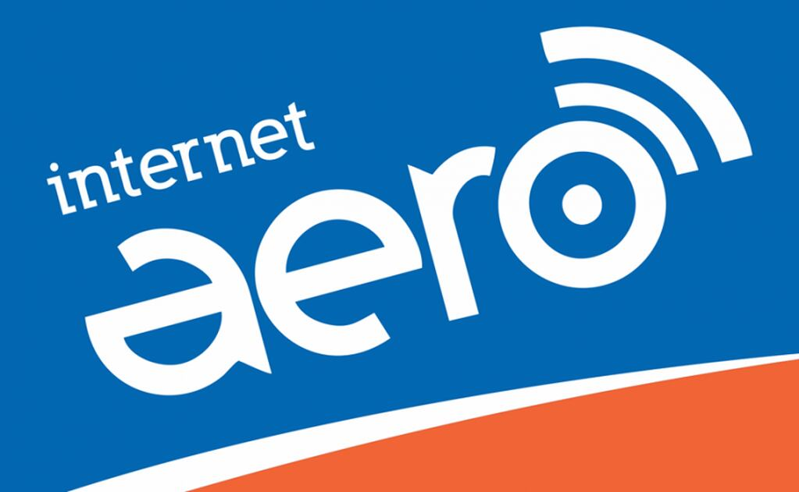
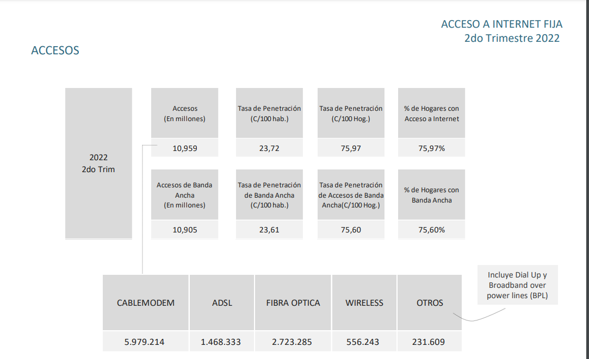
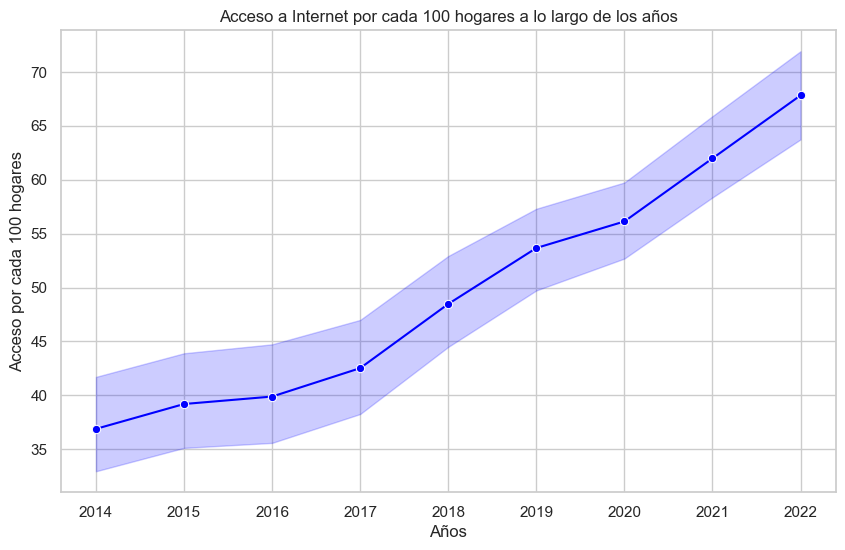
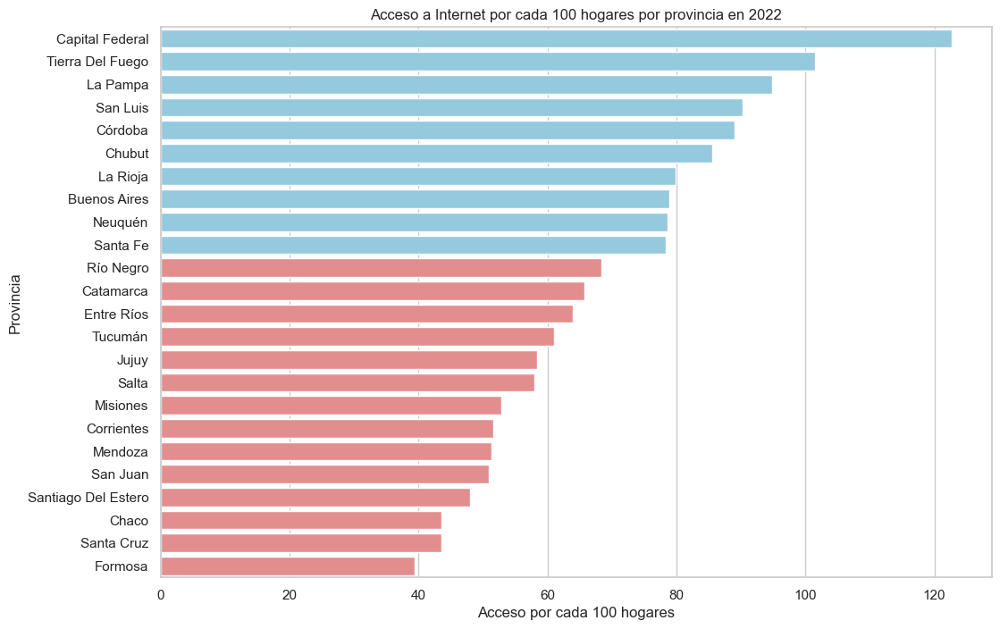
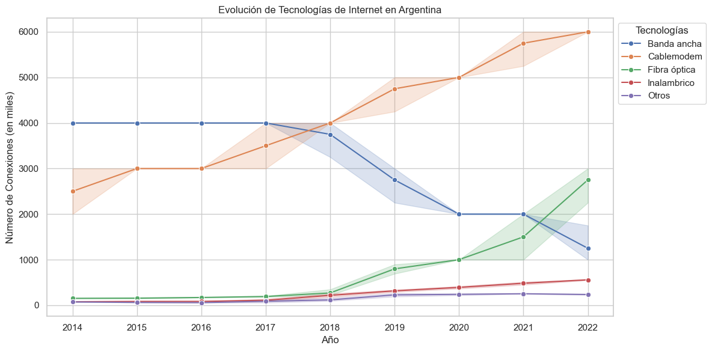
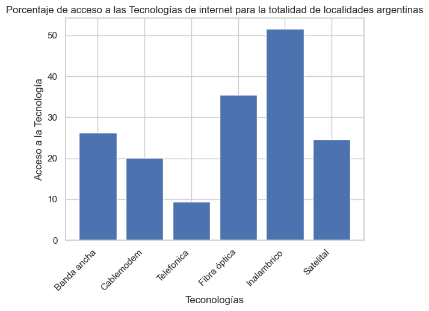

# Análisis del estado de internet en Argentina con foco en accesos aéreos. 

Internet es un elemento fundamental de nuestro día a día, porque, en la actualidad, estar desconectado es sinónimo de estar excluido de oportunidades para acceder a información básica, aprender y trabajar entre otros.

# Empresa

AERO es una empresa mendocina, dedicada a prestar servicios de internet y telefonía en distintas áreas de Mendoza, y actualmente otras provincias como San Juan. AERO no tiene cables, siempre llegam más lejos, a esos lugares que las grandes empresas han olvidado. También prentende "volar cada vez más rápido", mejorando día a día las prestaciones de servicio, y para ello invierte permanentemente en tecnología. Buscan fidelizar sus clientes sin tener que recurrir a contratos de permanencia difíciles de resindir, consideran que los clientes deben ser plenamente libres en sus elecciones.  

Los servicios prestados por Aero ofrecen planes desde 6 Mbps hasta 50 Mbps y se subdividen a sus clientes en dos categorías y ademas un modelo de franquicia :

* Hogares 
* Servicios corporativos: Estos últimos pensados para profesionales y empresas con múltiples necesidades de conectividad.Los servicios corporativos se caracterizan por asegurar un ancho de banda permanente, sin pérdida de rendimiento durante todo el día. Además, son servicios simétricos donde las velocidades máximas de subida y de bajada son iguales. Ante necesidades especiales, Aero dispone de anchos de banda ilimitados "DEDICADOS" con conexiones punto a punto.

* Socio local o Franquicido: Aero internet es un modelo de negocio replicable en cualquier parte del país e inclusive en el exterior. La infraestructura de red y sistema de administración remota,  permite operar en localidades lejanas a la provincia de Mendoza. Teniendo un socio local o "franquiciado", que atiende la zona adjudicada, se proyecta un crecimiento sostenido del cual se benefician ambas partes. El programa de franquicias Aero es una gran oportunidad comercial, ideal para emprendedores dispuestos a competir en un mercado de crecimiento constante.

# Objetivo 

Colaborar en el entendimiento del Mercado de Internet Fijo en Argentina, sus tendencias, tecnologías y necesidades y así poder brindar herramientas para la toma de decisiones de la empresa Aero, basada en internet sin cables. 

#Análisis 

Se realizó un exaustivo análisis de los datos provistos por ENACOM, Ente Nacional de Comunicaciones de Argentina. Este estudio se subdividió en tres partes: accesos por hogares, tecnologías y velocidades disponibles en las distintas provincias y localidades de Argentina.

Los datos fueron descargados desde la página de ENACOM en formato Excel en los casos posibles o en formato CSV. La interacción con la API no fue exitosa, solo se pudo descargar un archivo de esta manera que se detalla en el archivo del este repositorio como ETL. Los archivos fueron descargados del siguiente link: https://datosabiertos.enacom.gob.ar/dashboards/20000/acceso-a-internet/.

En el archivo EDA, se trabajó con las siguientes librerías: 
* pandas
* matplotlib.pyplot 
* seaborn 
* numpy 

Los archivos descargados en formato Excel estaban en mejor condición de formato y eran prácticamente útiles de inmediato. En algunos archivos como el caso de tecnología en formato CSV, era necesario hacer transformaciones ya que al entrar en este formato habían problemas de comas y puntos y los datos. Para conocer que valores eran correctos y cuales incorrectos sirvió hacer algunas lecturas de información adicional como el siguiente gráfico:

#### Para poder explorar los Datasets se procedió de forma general de la siguiente manera: 

* Abrir el DataFrame.
* Ver las primeras filas.
* Hacer info, ver nulos, cantidad de columnas y tipo de datos de cada columna.
* Hacer conversion de tipo de formato de variables, por ejemplo object a category o int (entero) o float (flotante/decimal) según el caso.
* Reemplazar según sea el caso caracteres, por ejemplo puntos por comas. 
* Revisar unidades y corregir en caso de ser necesario. Por ejemplo millones vs miles. 
* Elimnar columnas vacías.
* Borrar duplicados.
* Cambiar nombres de columnas usando replace().
* Revisar los cambios.
* Observar datos de variables categóricas con funciones como unique() y value_counts().
* Observar datos de variables númericas con funciones como describe().
* Analizar con gráficos los outlayers y tomar decisiones si conservarlos. 
* Hacerle preguntas a los Datos contestando con tablas y gráficos
* En algunos casos, se cruza información para responder estas preguntas. 
* Se escriben observaciones en general y en particular de los gráficos. 

#### El orden de los DataFrames es el siguiente:

1) Penetración de Internet fijo por Provincia 
2) Acceso a Internet fijo por Tecnología y Provincia
3) Accesos Internet fijo por Tecnología en todo el País
4) Accesos a Internet fijo por Tecnología y Localidad
5) Acceso a Internet fijo por rangos de Velocidad de bajada y provincia
6) Listado de Localidades con Conectividad a Internet
7) Accesos a Internet fijo por Velocidad de bajada y Localidad
8) Histórico Velocidad Internet por Provincias

## Acceso

En la última década, Argentina ha experimentado un crecimiento sostenido en la conectividad a Internet, evidenciando un cambio significativo en la vida cotidiana de sus habitantes. La penetración de Internet en los hogares argentinos ha mostrado un incremento constante, alcanzando un notable porcentaje de hogares conectados por cada 100 hogares. Este fenómeno no solo ha transformado la forma en que los ciudadanos acceden a la información, sino que también ha impulsado el desarrollo de nuevos servicios y oportunidades en línea, consolidando a la conectividad como un elemento clave en el tejido social y económico del país.

A pesar del crecimiento generalizado en la conectividad a Internet en Argentina, persisten disparidades significativas en el acceso entre las provincias. Un análisis detallado para el año 2022 revela que algunas provincias exhiben una mayor proporción de hogares conectados por cada 100 hogares, mientras que otras enfrentan desafíos en términos de acceso a la red. Las provincias en tono celeste representan aquellas que superan la media nacional, demostrando un mayor alcance y adopción de la conectividad, mientras que las provincias en tono coral reflejan un acceso más limitado en comparación con la media nacional. Esta brecha en la conectividad subraya la necesidad de enfoques específicos para abordar la desigualdad digital y garantizar un acceso equitativo a los beneficios de la era digital en todas las regiones del país.

## Tecnología

### Diccionario:

La posibilidad de contratar distintas modalidades de acceso a Internet depende de las ofertas de los operadores en determinada zona geográfica y así también como de la disponibilidad y posibilidades técnicas dentro de dicha zona. 

A continuación, una breve explicación de las distintas modalidades de acceso existentes:

* Acceso Telefónico (Dial-Up):  acceso a Internet a través de un MODEM (1) telefónico y desde una línea del servicio básico de telefonía.

* Acceso por ADSL:acceso a Internet por banda ancha. Utilizar para el tráfico de datos el mismo cable telefónico que para las transmisiones de voz, pero en bandas de frecuencia diferentes. 

* Acceso por Cablemodem: servicio provisto por las prestadoras de televisión por cable

* Acceso por Red de Telefonía Móvil:  utilizan en el país las mismas bandas de frecuencia de la telefonía móvil.

* Acceso Inalámbrico o Wireless: Wireless Internet Service Provider. Básicamente son proveedores de Internet que ofrecen conexión de forma inalámbrica

* Acceso Satelital: el acceso a Internet a través de tecnología Satelital ha tomado relevancia a la hora de proveer el servicio en localidades rurales o con una topografía tal que dificulte la implementación del acceso cableado y/o inalámbrico.

* Acceso por Fibra Optica: transmisión de información a través de la fibra, sumado a sus bajos costos de fabricación

* Acceso por Línea Eléctrica: esta modalidad de acceso a Internet por BPL (1) es la más reciente en el mundo de las telecomunicaciones, posee una gran ventaja respecto de sus competidoras en tanto las redes eléctricas son, por lo general, las que cuentan con la mayor penetración y capilaridad a nivel internacional pero como contrapartida de este mayor acceso al hogar del consumidor puede mencionarse que este tipo de tecnología necesita mayores controles de seguridad al momento de su instalación y durante su uso en tanto, no olvidemos, se trata de conectar equipos de comunicaciones a la corriente eléctrica hogareña de 220V.(1) Broadband Power Line.

* WiMAX: Worldwide Interoperability for Microwave Access, lo que en español se podría traducir como Interoperabilidad Mundial para Acceso por Microondas. Se trata de un método de transmisión de datos a través de ondas de radio, y que utiliza las frecuencias de 2,5 a 5,8 GHz. Útil en zonas rurales, sin necesidad de satélites. 

Fuente: ENACOM, 2022: https://www.enacom.gob.ar/tipos-de-conexion_p112

### ¿Qué tecnologías usa cada provincia y en que proporción para el 4to trimestre del año 2022?

En el gráfico de barras apiladas por porcentaje, se ofrece una visión general de la distribución de tecnologías de conexión a Internet en las provincias argentinas para el 2022, normalizando la variabilidad de la población. Cada color en la barra representa el porcentaje de conexiones de una tecnología específica en cada provincia. Observamos que el Cablemodem es la tecnología más ampliamente adoptada, abarcando entre el 50% y el 80% de los accesos en diferentes provincias. La Fibra óptica sigue como una opción sólida, generalmente representando alrededor del 30% de las conexiones, aunque algunas provincias, como Catamarca, destacan con un 60%. La tecnología de Banda ancha fluctúa entre el 15% y el 20%, siendo más prominente en San Juan con casi el 40%. Las conexiones Inalámbricas, con aproximadamente el 10%, ofrecen una presencia significativa. Destaca la presencia de la categoría "Otros" en provincias como Formosa, San Luis, Santa Cruz, Tierra del Fuego y Tucumán, representando entre el 50% y el 90% de las conexiones, aunque con detalles limitados. Este análisis proporciona una panorámica comprehensiva de la infraestructura de Internet en Argentina, evidenciando las preferencias y desafíos específicos de cada región.

Siguiendo con el análisis, el gráfico de línea proporciona una visión clara de las tendencias en la adopción de tecnologías de Internet en Argentina a lo largo del tiempo. Destaca un aumento sostenido de la tecnología "Cablemodem", que ha experimentado un notable crecimiento desde aproximadamente 2.5 millones de conexiones en 2014 hasta alcanzar los 6 millones en 2022. Contrariamente, la tecnología "Banda ancha" ha experimentado una marcada disminución a partir de 2017-2018, pasando de ser la principal tecnología con 4 millones de conexiones a situarse como la tercera opción, con un poco más de 1 millón en 2022.

En un cambio significativo, la tecnología "Fibra óptica" ha emergido como una opción en ascenso, mostrando un aumento perceptible a partir de 2018 y acentuándose en 2020. Este incremento llevó a la tecnología de Fibra óptica desde 140,000 conexiones en 2014 hasta alcanzar 3 millones en 2022. Por otro lado, la categoría "Inalámbrico" experimenta un crecimiento más moderado, alcanzando en 2022 un total de 573,000 conexiones a nivel nacional. Este análisis temporal proporciona una perspectiva detallada sobre la evolución dinámica de las preferencias de conexión en la sociedad argentina.

### ¿El acceso a las tecnologías de internet fijo, es similiar en todas las localidades?

Una realidad importante en la conectividad de Argentina, es que las tecnologías principales como Cablemodem, Fibra óptica y Banda ancha aún no alcanzan todas las localidades del país. De esta manera el acceso a Internet inalámbrico se destaca como la opción más extendida, abarcando una mayor cantidad de localidades y reflejando un carácter más federal en su alcance. Dada la baja densidad poblacional, la extensión territorial y las áreas mal conectadas, el Internet inalámbrico emerge como una solución ampliamente adoptada.

Es interesante observar que, aunque Cablemodem lidera en términos de accesos a nivel nacional, estos estén concentrados en localidades más grandes. Por otro lado, la Fibra óptica, siendo una tecnología relativamente económica, se posiciona como una opción para conectar localidades de densidades intermedias y pequeñas, pero excluyendo hogares aislados.

## Velocidad

Lo que se puede apreciar es una baja velocidad de bajada en las localidades que solo tienen accesos aéreos de Internet Fijo. 
Se puede ver más detalles de este análisis en el archivo a_EDA de este repositorio. 

## KPI

Se realizaron tres KPI

El primero para evaluar el cambio en el acceso a internet fijo por cada 100 hogares por provincia y por trimestres. 
El segundo evalúa el cambio en la adopción de internet inalámbrico por provincia y trimestre.
Y el tercero evalúa el cambio en la velocidad media de descarga por provincia y trimestre. 
